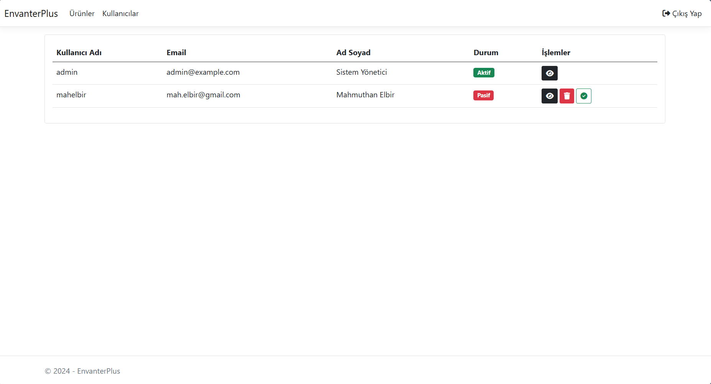

# EnvanterPlus

Ürün ve stok yönetimi için bir web uygulamasıdır.

## Özellikler

- Yönetici ve kullanıcı olarak rol sistemi
- Kullanıcı Giriş & Kayıt
- Kullanıcı Aktif/Pasif Durumu
- Kullanıcı Güncelleme/Silme
- Ürün Ekleme/Güncelleme/Silme
- Stok Ekleme/Güncelleme/Silme
- Ürünleri belli kriterlere göre filtreleme

## Ek Bilgiler
- Veritabanı olarak "MSSQL" kullanmaktadır
- Altyapı olarak ".Net Core 8.0 MVC" kullanmaktadır
- Veritabanı tabloları "migration" kullanılarak oluşturulmaktadır
- "sql" klasöründe test için ürün ve stok örnekleri bulunmaktadır
- "appsettings.json" dosyasından veritabanı bilgileri yapılandırılabilir
- Varsayılan yönetici giriş bilgileri "admin:Admin123"

## Ekran Görüntüleri

